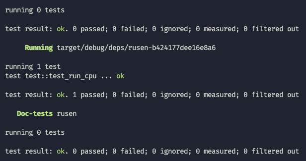

# rusen

[![build]](https://github.com/TaKO8Ki/rusen/actions?query=branch%3Amaster)

[build]: https://img.shields.io/github/workflow/status/TaKO8Ki/rusen/CI/master

NES Emulator written in Rust

## History

### Hello World!

### Pass CPU test

